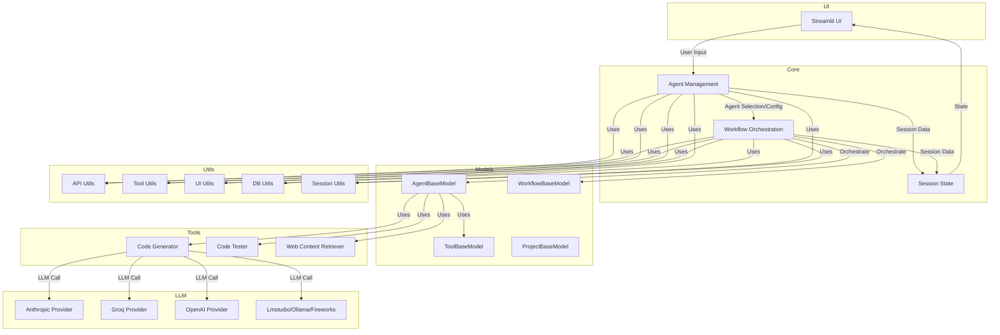

Here is a detailed plan for explaining the code in [`AutoGroq.md`](AutoGroq.md:1), following your request for a high-level architectural overview, a section-by-section summary, and a Mermaid diagram of the main components and their interactions.

---

## 1. **High-Level Architectural Overview**

**AutoGroq** is a modular, extensible framework for orchestrating teams of AI agents (and their tools) to solve complex user requests. It leverages LLMs (Large Language Models) from multiple providers (Anthropic, Groq, OpenAI, etc.), and provides a Streamlit-based UI for interactive agent management, workflow orchestration, and tool integration.

**Key Concepts:**
- **Agents**: Modular AI entities with roles, goals, and tools.
- **Tools**: Python functions (with metadata) that agents can use.
- **Workflows**: Orchestrated multi-agent collaborations, managed as group chats.
- **LLM Providers**: Pluggable backends for language model inference.
- **Session State**: Streamlit's session state is used to manage all runtime data.

---

## 2. **Main Components and Their Interactions (Mermaid Diagram)**

---

## 3. **Section-by-Section Summary**

### 3.1. **Agent Management**
- Handles agent selection, editing, and interaction callbacks in the UI.
- Constructs requests for agents, manages tool execution, and updates session state.
- Supports dynamic and built-in agents, with UI for editing agent properties.

### 3.2. **Main Application (`main.py`)**
- Streamlit entry point.
- Initializes session state, loads models/tools, and sets up the UI layout.
- Handles user input, agent display, and model/provider selection.

### 3.3. **Prompts**
- Contains prompt templates for project planning, agent creation, tool generation, moderation, and prompt rephrasing.
- Used to guide LLMs in generating structured outputs (e.g., agent/team JSON, project plans).

### 3.4. **Agent Definitions**
- Each agent (e.g., Code Developer, Code Tester, Web Content Retriever) is a class inheriting from `AgentBaseModel`.
- Agents have roles, goals, tools, and provider/model configuration.
- Each agent can be instantiated with default settings.

### 3.5. **CLI Tools**
- Scripts for creating agents and rephrasing prompts from the command line.
- Useful for automation and batch operations.

### 3.6. **Configuration**
- Centralized config for LLM providers, model limits, API URLs, and built-in agent names.
- Supports user-specific overrides via `config_local.py`.

### 3.7. **LLM Providers**
- Abstracts API calls to Anthropic, Groq, OpenAI, LMStudio, Ollama, and Fireworks.
- Each provider implements a common interface for sending requests and processing responses.

### 3.8. **Models**
- `AgentBaseModel`, `ToolBaseModel`, `WorkflowBaseModel`, and `ProjectBaseModel` define the core data structures.
- Support serialization/deserialization and encapsulate agent/tool/workflow/project properties.

### 3.9. **Tools**
- Python modules implementing agent-usable tools (e.g., code generation, code testing, web content fetching).
- Each tool is wrapped in a `ToolBaseModel` for metadata and function binding.

### 3.10. **Utils**
- **Agent Utils**: Agent data normalization and creation.
- **API Utils**: LLM provider management, API key handling, and model fetching.
- **Auth Utils**: API key and URL input management.
- **DB Utils**: Export/import to SQLite for persistence.
- **Error Handling**: Logging and error reporting.
- **File Utils**: Workflow/agent/tool export and zipping.
- **Sandbox**: Safe tool execution.
- **Session Utils**: Streamlit session state initialization and management.
- **Text Utils**: Text normalization and sanitization.
- **Tool Execution/Utils**: Tool loading, execution, and export.
- **UI Utils**: All Streamlit UI logic, including discussion, whiteboard, deliverables, and download/export.

---

## 4. **How the Pieces Fit Together**

- The user interacts with the **Streamlit UI** to define a project/request.
- The system uses LLMs (via prompt templates) to generate a project plan and a team of agents.
- Agents are instantiated, each with a role, description, and tools.
- The user (or moderator agent) orchestrates agent interactions, with agents using tools as needed.
- All state is managed in Streamlit's session, and data can be exported for use in other systems (e.g., Autogen, CrewAI).
- The architecture is modular, allowing new agents, tools, and LLM providers to be added with minimal changes.

---

## 5. **Next Steps**

- Please review this plan and let me know if you would like any changes, more detail in any section, or a different focus.
- Once approved, I can write this explanation to a markdown file if desired, and then you can switch to code mode to implement or further process the solution.

Would you like to proceed with this plan as described, or would you like any adjustments?