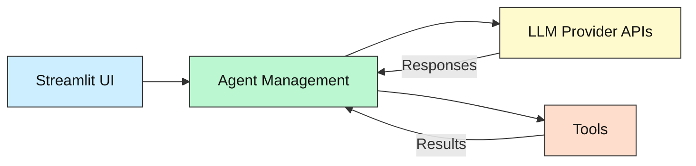
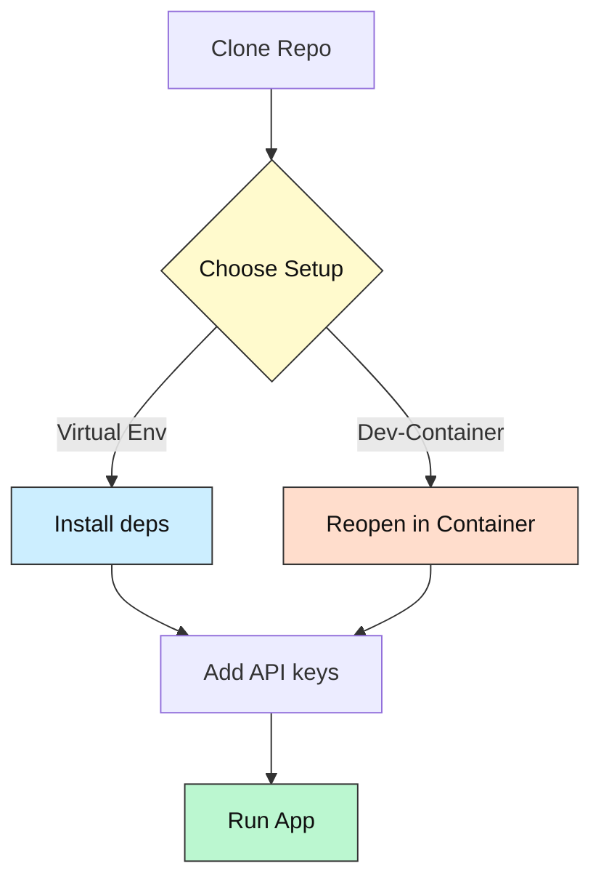

```mermaid
flowchart TD

    AGENTS["agents/"] --> AG1["code_developer.py"]
    AGENTS --> AG2["code_tester.py"]
    AGENTS --> AG3["web_content_retriever.py"]

    CLI["cli/"] --> CLI1["create_agent.py"]
    CLI --> CLI2["rephrase_prompt.py"]

    CONFIG["configs/"] --> CFG1["config.py"]
    CONFIG --> CFG2["config_agent.py"]
    CONFIG --> CFG3["config_sessions.py"]
    CONFIG --> CFG4["current_project.py"]

    LLM["llm_providers/"] --> LLM1["openai_provider.py"]
    LLM --> LLM2["anthropic_provider.py"]
    LLM --> LLM3["groq_provider.py"]
    LLM --> LLM4["fireworks_provider.py"]
    LLM --> LLM5["lmstudio_provider.py"]
    LLM --> LLM6["ollama_provider.py"]
    LLM --> LLM7["base_provider.py"]

    MODELS["models/"] --> M1["agent_base_model.py"]
    MODELS --> M2["tool_base_model.py"]
    MODELS --> M3["project_base_model.py"]
    MODELS --> M4["workflow_base_model.py"]

    TOOLS["tools/"] --> T1["code_generator.py"]
    TOOLS --> T2["code_test.py"]
    TOOLS --> T3["fetch_web_content.py"]

    UTILS["utils/"] --> U1["api_utils.py"]
    UTILS --> U2["auth_utils.py"]
    UTILS --> U3["error_handling.py"]
    UTILS --> U4["file_utils.py"]
    UTILS --> U5["session_utils.py"]
    UTILS --> U6["tool_execution.py"]
    UTILS --> U7["tool_utils.py"]
    UTILS --> U8["ui_utils.py"]
    UTILS --> U9["workflow_utils.py"]
    UTILS --> U10["agent_utils.py"]
    UTILS --> U11["db_utils.py"]
    UTILS --> U12["sandbox.py"]
    UTILS --> U13["text_utils.py"]

    style AGENTS fill:#cceeff,stroke:#333333,color:#111111
    style CLI fill:#bbf7d0,stroke:#333333,color:#111111
    style CONFIG fill:#fffacd,stroke:#333333,color:#111111
    style LLM fill:#ffddcc,stroke:#333333,color:#111111
    style MODELS fill:#cceeff,stroke:#333333,color:#111111
    style TOOLS fill:#bbf7d0,stroke:#333333,color:#111111
    style UTILS fill:#fffacd,stroke:#333333,color:#111111
```

# Vibe Coders: AutoGroq

[](https://python.org)
[](https://github.com)
[](LICENSE)
[](https://github.com/codespaces/new?repo=VibeCoders%2FAutoGroq&machine=basicLinux32gb)

---

## 1. What & Why

**AutoGroq** is a modular, beginner-friendly platform for orchestrating teams of AI agents using large language models (LLMs). It provides a visual interface (Streamlit) for managing, configuring, and running multi-agent workflows, supporting multiple LLM providers and custom tools.  
Perfect for prompt engineers, new devs, and anyone wanting to experiment with agent-based AI automation—no prior experience required.

> **Note:** AutoGroq is fully cross-platform and works on **Windows, macOS, and Linux**. All setup and usage instructions are provided for each OS.

---

## 2. Tech-Stack Overview

| Layer         | Tech                                      |
| ------------- | ----------------------------------------- |
| **Language**  | Python 3.10+                              |
| **UI**        | Streamlit                                 |
| **LLM APIs**  | OpenAI, Anthropic, Groq, Fireworks, etc.  |
| **Container** | Dev-Container (`.devcontainer/`) (opt)    |
| **Testing**   | (pytest recommended)                      |
| **CLI**       | Python CLI scripts                        |

Minimum: **Python 3.10+**, **Docker/Podman ≥ 4.0** (for Dev-Container).

---

## 3. Key Features

- Visual agent management (create, edit, delete, configure)
- Multi-provider LLM support (OpenAI, Anthropic, Groq, Fireworks, etc.)
- Modular tool integration (code generation, web content, testing)
- Streamlit-based UI for zero-friction use
- CLI utilities for advanced workflows
- Secure API key management
- Extensible: add your own agents, tools, and providers
- **Cross-platform:** works on Windows, macOS, and Linux

---

## 4. System Overview Diagram



---

## 5. Folder / File Guide

```text
📂 AutoGroq
 ├─ agents/              # Built-in agent definitions
 ├─ cli/                 # CLI utilities
 ├─ configs/             # Config files (providers, sessions, etc.)
 ├─ llm_providers/       # LLM provider adapters
 ├─ models/              # Data models (agents, tools, workflows)
 ├─ tools/               # Tool implementations (code, test, web)
 ├─ utils/               # Utility modules (API, UI, error, etc.)
 ├─ .gitignore
 ├─ agent_management.py  # Core agent management logic
 ├─ main.py              # Streamlit app entry point
 ├─ prompts.py           # Prompt templates
 ├─ secrets.toml         # API keys (never commit)
 ├─ style.css            # Custom Streamlit styles
```



---

## 6. Prerequisites & Accounts

| Need this                        | Why                | Link                                                                 |
| -------------------------------- | ------------------ | -------------------------------------------------------------------- |
| Python 3.10+                     | Core runtime       | https://python.org                                                   |
| Streamlit                        | Visual interface   | https://streamlit.io                                                 |
| VS Code + Dev-Containers ext.    | 1-click sandbox    | https://marketplace.visualstudio.com/items?itemName=ms-vscode-remote.remote-containers |
| Docker / Podman (for container)  | Dev-Container      | https://www.docker.com/                                              |
| LLM API keys (OpenAI, etc.)      | Call real LLMs     | Provider dashboards                                                  |

> **AutoGroq is cross-platform:** All features work on Windows, macOS, and Linux.

---

## 7. Setup Options

### A. Local Virtual Environment (recommended for first-timers)

```bash
git clone https://github.com/VibeCoders/AutoGroq.git
cd AutoGroq
python -m venv .venv
# On Linux/macOS:
source .venv/bin/activate
# On Windows PowerShell:
.\.venv\Scripts\Activate.ps1
pip install -r requirements.txt
# Add your API keys to AutoGroq/secrets.toml
streamlit run AutoGroq/main.py
```

### B. VS Code Dev-Container (no local installs)

Prereqs: Docker or Podman, VS Code + Dev Containers extension.

1. Open folder in VS Code
2. Command Palette → “Dev Containers: Reopen in Container”
3. Wait for auto-build and dependency install
4. Launch app: `streamlit run AutoGroq/main.py`

[](https://github.com/codespaces/new?repo=VibeCoders%2FAutoGroq&machine=basicLinux32gb)

---

## 8. Setup Flowchart Diagram



---

## 9. Running / Quick Commands

```bash
# Start the Streamlit app
streamlit run AutoGroq/main.py

# (Optional) Run CLI utilities
python AutoGroq/cli/create_agent.py
python AutoGroq/cli/rephrase_prompt.py

# (Recommended) Run tests (if you add pytest)
pytest -q
```

---

## 10. Configuration & API Keys 🔑

### What goes in `AutoGroq/secrets.toml`?

Add your API keys for the LLM providers you want to use.  
**Format:** Each key is a quoted string, one per line. Only include the keys you need.

**Example:**
```toml
OPENAI_API_KEY = "sk-..."
ANTHROPIC_API_KEY = "sk-..."
GROQ_API_KEY = "gsk_..."
FIREWORKS_API_KEY = "fk-..."
```
- Replace the values with your actual API keys from each provider.
- You do **not** need to include keys for providers you don't use.
- `OLLAMA` and `LMSTUDIO` do not require API keys by default (local inference).

**Supported keys:**
- `OPENAI_API_KEY`
- `ANTHROPIC_API_KEY`
- `GROQ_API_KEY`
- `FIREWORKS_API_KEY`

**Security Note:**  
Do **not** commit `secrets.toml` to version control. It is already in `.gitignore`.

If using Codespaces or CI, add these as repository secrets instead.

---

## 11. Troubleshooting / FAQ

| Symptom                 | Cause                | Fix                                         |
| ----------------------- | -------------------- | --------------------------------------------|
| `ModuleNotFoundError`   | venv not activated   | `source .venv/bin/activate`                 |
| VS Code “cannot attach” | Docker daemon off    | Start Docker Desktop / Podman               |
| 401 from LLM provider   | Missing API key      | Add key to `secrets.toml` or Codespace secret |

---

## 12. Status & Roadmap

- ✅ Multi-agent orchestration
- ✅ Multi-provider LLM support
- ✅ Modular tool integration
- ⏳ Enhanced test coverage
- ⏳ More built-in agent templates
- ⏳ Improved error handling and UI polish

---

## 13. How AI Helped

AutoGroq was designed and iterated with the help of LLMs for code generation, prompt design, and documentation.

---

## 14. License & Attribution

MIT – see [LICENSE](LICENSE).

---

## 15. Community Support / Feedback

- Open an issue for questions or ideas
- PRs welcome – docs, tests, or features!
- New to coding? Tag your issue with **`beginner-help`** and we’ll mentor you.

---

*Happy hacking – may your agents be ever more helpful!*